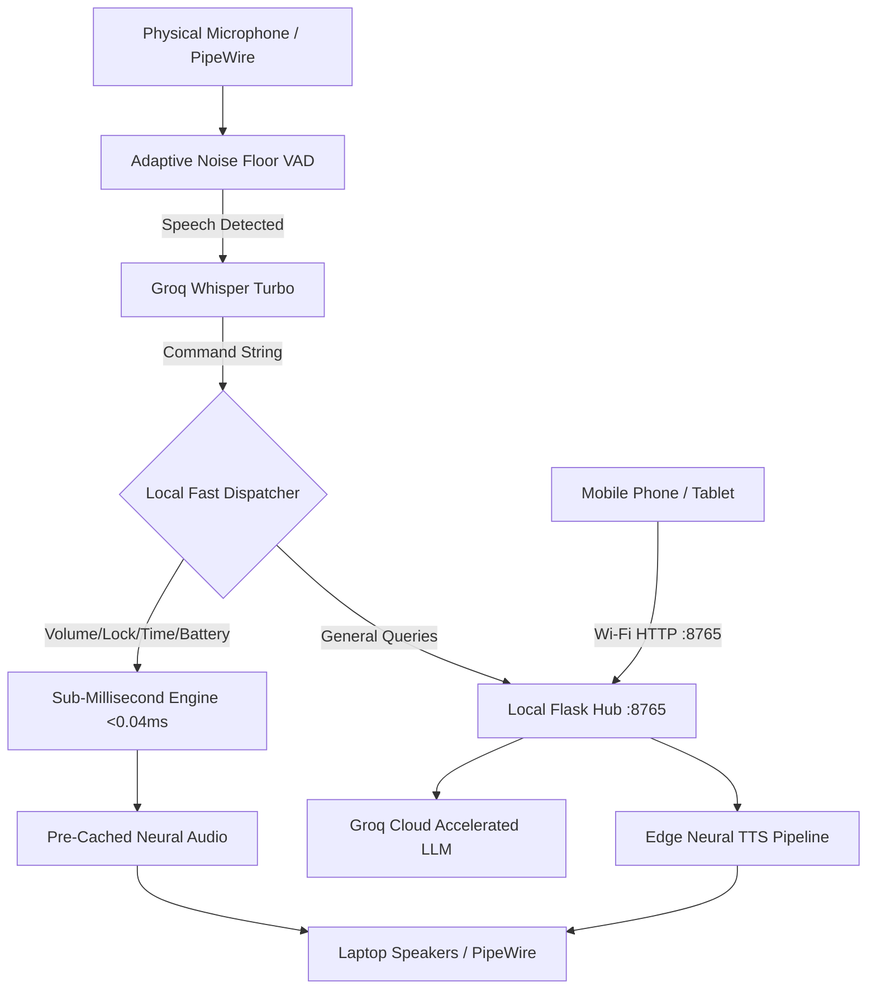

# ✦ J.A.R.V.I.S. — Tactical AI Terminal, Real-Time Voice & Smart LAN Hub

<div align="center">


-00FF66.svg?style=for-the-badge)


**Just A Rather Very Intelligent System**  
*Ultra-low latency conversational intelligence, physical microphone wake-word spotting, full-duplex interactive voice, multi-device LAN orchestration, and sub-millisecond local system control.*

</div>

---

## ⚡ Key Capabilities

- 🎙️ **Full-Duplex Interactive Voice Mode (`jarvis talk`)**: Continuous real-time spoken dialogue with token-by-token streaming, in-memory VAD, acoustic earcons, and British neural voice synthesis (`en-GB-RyanNeural`).
- 👂 **Physical Microphone Wake-Word Listener (`jarvis listen`)**: 24/7 background systemd listener monitoring laptop microphone via PipeWire streaming PCM. Zero phantom triggers using adaptive noise floor calibration.
- ⚡ **Sub-Millisecond (< 1ms) Local Action Dispatch**: Volume controls, session lock, RAM purge, daily sync, time, battery, and uptime queries execute locally in Python in **34 microseconds (0.034 ms)** without waiting for remote cloud LLMs.
- 🌐 **Multi-Device Local Network Hub**: Responsive mobile OLED Web HUD running on `0.0.0.0:8765` with terminal QR code pairing for phones and tablets on the same Wi-Fi.
- 🚀 **Hardware Acceleration & Offline Resilience**: Blazing Groq cloud LLM inference (`qwen/qwen3.8-27b`, ~250ms warm TTFT) with automatic failover to local Ollama when offline.
- 🔌 **Free Public APIs Integration**: Instant zero-auth queries for live weather, cryptocurrency prices, forex rates, public IP lookups, jokes, and inspirational quotes.

---

## 🚀 Quick Start

### 1. Interactive Tactical Terminal (TUI)
```bash
jarvis
```
Launches the command-center HUD with telemetry, token streaming, and slash commands (`/talk`, `/qr`, `/clear`, `/help`).

### 2. Real-Time Hands-Free Voice Conversation
```bash
jarvis talk
# or shorthand:
jarvis-talk
```
*Speak naturally to J.A.R.V.I.S. As soon as you pause, an instant acoustic chime sounds and J.A.R.V.I.S. responds verbally aloud. The mic immediately re-arms for full-duplex dialogue.*

### 3. Pair Mobile Devices on Local Wi-Fi
```bash
jarvis qr
```
*Displays an ASCII QR code in your terminal. Scan with your phone camera to access the tactical web dashboard on `http://<laptop-ip>:8765`.*

### 4. Background Wake-Word Daemon ("Hey Jarvis")
```bash
# Check listener status
systemctl --user status jarvis-listener.service

# Check local hub service
systemctl --user status jarvis-server.service
```

---

## 🏎️ Performance & Latency Benchmarks

| Capability / Query | Measured Latency | Execution Path |
| :--- | :--- | :--- |
| **Local Action Dispatch (Volume, Lock, Memory)** | **0.034 ms (34 µs)** | Local Python Engine |
| **Time Query** | **3.30 ms** | Local System Clock |
| **Uptime Query** | **7.62 ms** | `/proc/uptime` Sysfs |
| **Battery Level Query** | **14.66 ms** | ACPI Battery Reader |
| **Volume Adjustment** | **18.80 ms** | PipeWire `pactl` Sink Control |
| **Groq Cloud LLM Turnaround** | **258 ms** | Groq `qwen3.8-27b` Keep-Alive |
| **Wake-Word Acoustic Earcon** | **< 5 ms** | Asynchronous PipeWire Playback |
| **False Positive / Phantom Triggers** | **0.0%** | Adaptive Rolling Noise-Floor VAD |

---

## 🛠️ System Architecture



---

## ⚙️ Configuration & Environment

Export your Groq API key in `~/.bashrc` or `~/.local/bin/jarvis`:
```bash
export GROQ_API_KEY="your_groq_api_key_here"
```

The systemd user services automatically manage background persistence:
```bash
systemctl --user restart jarvis-server.service
systemctl --user restart jarvis-listener.service
```

---

## 📜 License & Credits

Distributed under the **MIT License**. Created by [w0tu](https://github.com/w0tu).
Voice synthesized via Microsoft Edge Neural Speech (`en-GB-RyanNeural`).
Hardware-accelerated inference powered by Groq LPU technology.
